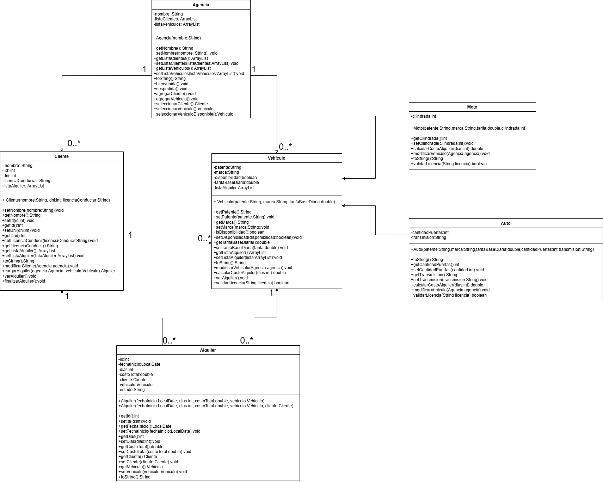

# Sistema de Gestión de Alquiler de Vehículos — Java POO

Sistema integral desarrollado en **Java** para la gestión y administración de alquileres de vehículos (autos y motos), clientes y contratos. El proyecto implementa los pilares de la **Programación Orientada a Objetos (POO)**, colecciones dinámicas y validación exhaustiva de datos.

---

## 🏛️ Arquitectura y Diagrama de Clases

El diseño del modelo de dominio desacopla las responsabilidades de las entidades de negocio, los contratos de alquiler y la orquestación del sistema:



---

## 🚀 Conceptos de POO y Diseño Implementados

* **Herencia y Polimorfismo:**
  * Clase abstracta base `Vehiculo` de la que heredan `Auto` y `Moto`.
  * Especialización de atributos y métodos de cálculo según el tipo de vehículo.
* **Encapsulamiento:**
  * Atributos privados con métodos de acceso y mutación (`getters`/`setters`), protegiendo el estado interno de las instancias.
* **Manejo de Colecciones Dinámicas:**
  * Uso de `ArrayList<T>` para el almacenamiento en memoria y administración de vehículos, clientes registrados y contratos activos/cerrados.
* **Separación de Responsabilidades:**
  * `Vehiculo`, `Auto`, `Moto`: Modelado de flota y estado.
  * `Cliente`: Datos y validaciones del conductor/arrendatario.
  * `Alquiler`: Registro de transacción, fechas y costo final.
  * `Agencia`: Lógica de negocio (búsquedas, asignación, disponibilidad y reportes).
  * `Funciones`: Capa transversal de validaciones de entrada, control de tipos y captura de excepciones.
  * `Main`: Interfaz de usuario interactiva y menú de operaciones en consola.

---

## 🛠️ Funcionalidades Principales

* 🚗 **Gestión de Flota:** Registro de autos y motos con atributos específicos (puertas, tipo, cilindrada), control de estado (alquilado/disponible) y cálculo de costo de combustible según capacidad del tanque.
* 👥 **Administración de Clientes:** Alta con validación de datos personales y selección guiada por listado de clientes habilitados.
* 📋 **Gestión de Alquileres:**
  * Generación de contratos vinculando cliente y vehículo mediante selección por menú indexado.
  * Devolución con cálculo automático de costos: tarifa por día, recargo por días de retraso y costo de carga de combustible.
* 🛡️ **Validaciones Robustas:**
  * Selección de entidades por índice numérico con control de límites para evitar excepciones de índice fuera de rango.
  * Control de entradas en consola (números enteros/flotantes, rangos lógicos, cadenas no vacías y fechas válidas).

---

## 💻 Requisitos y Ejecución

* **JDK:** Java SE 17 o superior.
* **IDE recomendado:** IntelliJ IDEA o Eclipse.


### Compilación y ejecución por consola:

```bash
# Compilar todas las clases dentro de src
javac -d bin src/agencia/*.java

# Ejecutar el punto de entrada
java -cp bin agencia.Main
````
> 🎓 Contexto académico: Proyecto desarrollado para la materia Programación Orientada a Objetos (2do Parcial) — Carrera de Analista de Sistemas.
